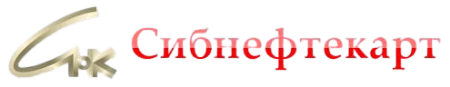

# Полный изменённый код

## index.html

~~~~html
<!doctype html>
<html lang="ru">
  <head>
    <meta charset="utf-8" />
    <meta name="viewport" content="width=device-width, initial-scale=1" />
    <meta
      name="description"
      content="Сибнефтекарт разрабатывает оборудование и программы для автоматизации АЗС, нефтебаз и процессинга топливных карт."
    />
    <title>Сибнефтекарт — автоматизация АЗС и нефтебаз</title>
    <link rel="stylesheet" href="assets/styles.css" />
  </head>
  <body data-page="home">
    <a class="skip-link" href="#main">Перейти к содержимому</a>
    <header class="site-header" data-site-header>
      <nav class="container fallback-nav" aria-label="Основная навигация">
        <a href="index.html"
          ></a
        ><a href="news.html">Новости</a
        ><a href="company-history.html">О компании</a
        ><a href="contacts.html">Контакты</a>
      </nav>
    </header>
    <main id="main" tabindex="-1">
      <section class="home-hero" aria-labelledby="home-title">
        

          

            Технологии для работы АЗС
            <h1 id="home-title">
              Вся работа станции — <em>в одной системе.</em>
            </h1>
            

              От приёма топлива и кассовых операций до обслуживания карт и
              обмена данными. Решения, которые помогают управлять АЗС каждый
              день.
            

            

              <a class="btn btn--primary" href="company-history.html"
                >Узнать о компании ↗</a
              ><a class="btn btn--ghost" href="contacts.html"
                >Связаться с нами →</a
              >
            

            

              ТОМСКРАЗРАБОТКА И ВНЕДРЕНИЕ
            

          

          <aside class="product-map" aria-labelledby="product-map-title">
            

              ПРОГРАММНОЕ ОБЕСПЕЧЕНИЕ
            

            <h2 id="product-map-title">ПО для задач станции</h2>
            
Коротко о модулях системы автоматизации АЗС.

            <ol class="product-map__list">
              <li>
                01
                

                  <strong>СНК-АЗС</strong
                  >Приём и отпуск топлива, магазин и склад
                

              </li>
              <li>
                02
                

                  <strong>СНК-МФ</strong
                  >Работа с топливными и бонусными картами
                

              </li>
              <li>
                03
                

                  <strong>СНК-КС</strong
                  >Защищённый обмен данными между системами
                

              </li>
              <li>
                04
                

                  <strong>СНК-КСО</strong
                  >Касса самообслуживания без оператора
                

              </li>
            </ol>
            <a
              class="product-map__link"
              href="https://www.sncard.ru/programmnoe-obespechenie/avtomatizatsiya-azs"
              target="_blank"
              rel="noopener noreferrer"
              >Весь каталог ПО ↗</a
            >
          </aside>
        

      </section>
      <section class="section home-services" aria-labelledby="services-title">
        

          

            01 / ЧТО МЫ ДЕЛАЕМ
            <h2 id="services-title">Технологии для всей сети</h2>
            
От оборудования на АЗС до работы с картами и данными в офисе.

          

          

            <article class="service-card">
              
▣

              01
              <h3>Автоматизация АЗС</h3>
              

                Системы управления оборудованием, отпуском топлива и операциями
                на станции.
              

              <a href="company-history.html#history"
                >История разработок ↗</a
              >
            </article>
            <article class="service-card">
              
▥

              02
              <h3>Программы для офиса</h3>
              

                Учёт, анализ и обмен данными между станциями и операционным
                центром.
              

              <a href="company-history.html#history"
                >Узнать больше ↗</a
              >
            </article>
            <article class="service-card">
              
▤

              03
              <h3>Процессинг карт</h3>
              

                Топливные, дисконтные и бонусные карты для обслуживания клиентов
                сети.
              

              <a href="news.html"
                >Новости сервиса ↗</a
              >
            </article>
          

        

      </section>
      <section class="section home-about" aria-labelledby="about-title">
        

          

            02 / О КОМПАНИИ
            <h2 id="about-title">Создано в Томске. Работает для АЗС.</h2>
            

              Компания выросла из научно-исследовательской лаборатории
              автоматизации. С 1993 года «Сибнефтекарт» разрабатывает системы
              для предприятий нефтепродуктообеспечения и развивает процессинг
              карт.
            

            <a class="btn btn--ghost" href="company-history.html"
              >История компании →</a
            >
          

          

            

              <strong>1987</strong
              >первая опытная система безналичных расчётов на АЗС в
                Томске
            

            

              <strong>1993</strong
              >создание научно-производственной фирмы «Сибнефтекарт»
            

            

              <strong>2019</strong
              >специализация на процессинге топливных, дисконтных и бонусных
                карт
            

          

        

      </section>
      <section class="section home-cta" aria-labelledby="home-cta-title">
        

          

            03 / НА СВЯЗИ
            <h2 id="home-cta-title">Есть вопрос по работе сервисов?</h2>
            
Служба по работе с клиентами и контакты офиса в Томске.

          

          <a class="btn btn--primary" href="contacts.html"
            >Перейти к контактам ↗</a
          >
        

      </section>
    </main>
    <footer class="site-footer" data-site-footer>
      

        © АО «НПФ «Сибнефтекарт»<a href="contacts.html">Контакты</a>
      

    </footer>
    
    
  </body>
</html>

~~~~

## news.html

~~~~html
<!doctype html>
<html lang="ru">
  <head>
    <meta charset="utf-8" />
    <meta name="viewport" content="width=device-width, initial-scale=1" />
    <meta
      name="description"
      content="Новости АО НПФ Сибнефтекарт — изменения сети АЗС, обслуживание топливных карт и важные уведомления."
    />
    <title>Новости — Сибнефтекарт</title>
    <link rel="stylesheet" href="assets/styles.css" />
  </head>
  <body data-page="news">
    <a class="skip-link" href="#main">Перейти к содержимому</a>
    <header class="site-header" data-site-header>
      <nav class="container fallback-nav" aria-label="Основная навигация">
        <a href="news.html">Новости</a
        ><a href="company-history.html">О компании</a
        ><a href="contacts.html">Контакты</a
        ><a href="https://cloud.sncard.ru/">Личный кабинет</a>
      </nav>
    </header>

    <main id="main" tabindex="-1">
      <section class="page-hero">
        

          

            <a href="index.html">Главная</a>/Новости
          

          

            

              Информационный центр
              <h1 class="page-title">Новости</h1>
              

                Изменения в работе АЗС, топливных карт и сервисов из официального архива компании.
              

            

            <label class="search-field" data-news-controls hidden
              >Поиск по новостям<input
                type="search"
                placeholder="Поиск по новостям"
                data-news-search
                aria-controls="news-list"
                autocomplete="off"
            /></label>
          

        

      </section>

      <section class="section">
        

          

            
<button class="filter-btn is-active" type="button" data-news-filter="all" aria-pressed="true">Все новости</button><button class="filter-btn" type="button" data-news-filter="2024" aria-pressed="false">2024</button><button class="filter-btn" type="button" data-news-filter="2023" aria-pressed="false">2023</button><button class="filter-btn" type="button" data-news-filter="2021" aria-pressed="false">2021</button><button class="filter-btn" type="button" data-news-filter="2020" aria-pressed="false">2020</button>

            10 публикаций
          

          

            <article class="news-card" tabindex="-1" data-news-year="2024">
17 мая 2024Сеть АЗС

<h3>Изменение списка АЗС, обслуживающих топливные карты</h3>
С 17 мая приостановлено обслуживание карт СНК и Партнёров на шести АЗС Томска и Томской области.

<a class="arrow-link" href="https://zao.sncard.ru/news" target="_blank" rel="noopener noreferrer" aria-label="Открыть публикацию в официальном архиве: 17 мая 2024">В архиве ↗</a></article>
            <article class="news-card" tabindex="-1" data-news-year="2024">
26 января 2024Сеть АЗС

<h3>Изменение списка АЗС, обслуживающих топливные карты</h3>
Прекращено обслуживание по картам СНК и Партнёров на АЗС ООО «СТД» в посёлке Кандинка.

<a class="arrow-link" href="https://zao.sncard.ru/news" target="_blank" rel="noopener noreferrer" aria-label="Открыть публикацию в официальном архиве: 26 января 2024">В архиве ↗</a></article>
            <article class="news-card" tabindex="-1" data-news-year="2023">
26 сентября 2023Сеть АЗС

<h3>Изменение списка АЗС, обслуживающих топливные карты</h3>
С 29 сентября приостановлено обслуживание по картам на АЗС в селе Малиновка Томского района.

<a class="arrow-link" href="https://zao.sncard.ru/news" target="_blank" rel="noopener noreferrer" aria-label="Открыть публикацию в официальном архиве: 26 сентября 2023">В архиве ↗</a></article>
            <article class="news-card" tabindex="-1" data-news-year="2023">
28 августа 2023Сервисы

<h3>Изменения настроек безопасности паролей личных кабинетов СНК</h3>
С 11 сентября вводится проверка паролей. При несоответствии требованиям пользователю предложат сменить пароль.

<a class="arrow-link" href="https://zao.sncard.ru/news" target="_blank" rel="noopener noreferrer" aria-label="Открыть публикацию в официальном архиве: 28 августа 2023">В архиве ↗</a></article>
            <article class="news-card" tabindex="-1" data-news-year="2023">
08 августа 2023Сеть АЗС

<h3>Изменение списка АЗС, обслуживающих топливные карты</h3>
Временно прекращено обслуживание карт на АЗС № 3 ООО «СеверНефтеПродукт» в Колпашево.

<a class="arrow-link" href="https://zao.sncard.ru/news" target="_blank" rel="noopener noreferrer" aria-label="Открыть публикацию в официальном архиве: 08 августа 2023">В архиве ↗</a></article>
            <article class="news-card" tabindex="-1" data-news-year="2023">
03 мая 2023Компания

<h3>Об изменении реквизитов</h3>
С 2 мая изменились телефон и адрес компании: Томск, ул. Розы Люксембург, 55; телефон 65-10-70.

<a class="arrow-link" href="https://zao.sncard.ru/news?start=5" target="_blank" rel="noopener noreferrer" aria-label="Открыть публикацию в официальном архиве: 03 мая 2023">В архиве ↗</a></article>
            <article class="news-card" tabindex="-1" data-news-year="2021">
15 октября 2021Сеть АЗС

<h3>Изменение списка АЗС, обслуживающих топливные карты</h3>
Прекращено обслуживание карт на АЗС № 8 ООО «СеверНефтеПродукт» в посёлке Комсомольск.

<a class="arrow-link" href="https://zao.sncard.ru/news?start=5" target="_blank" rel="noopener noreferrer" aria-label="Открыть публикацию в официальном архиве: 15 октября 2021">В архиве ↗</a></article>
            <article class="news-card" tabindex="-1" data-news-year="2021">
30 сентября 2021Сеть АЗС

<h3>Изменение списка АЗС, обслуживающих топливные карты</h3>
Временно прекращено обслуживание карт на АЗС № 6 ООО «СеверНефтеПродукт» в селе Чилино.

<a class="arrow-link" href="https://zao.sncard.ru/news?start=5" target="_blank" rel="noopener noreferrer" aria-label="Открыть публикацию в официальном архиве: 30 сентября 2021">В архиве ↗</a></article>
            <article class="news-card" tabindex="-1" data-news-year="2021">
29 сентября 2021Сеть АЗС

<h3>Изменение списка АЗС, обслуживающих топливные карты</h3>
Прекращено обслуживание карт на четырёх АЗС ООО «Томтрансойл» в Томской области.

<a class="arrow-link" href="https://zao.sncard.ru/news?start=5" target="_blank" rel="noopener noreferrer" aria-label="Открыть публикацию в официальном архиве: 29 сентября 2021">В архиве ↗</a></article>
            <article class="news-card" tabindex="-1" data-news-year="2020">
20 марта 2020Сеть АЗС

<h3>Изменение списка АЗС, обслуживающих топливные карты</h3>
В список принимающих карты СНК и Партнёров добавлена АЗС 33 в селе Новоколомино.

<a class="arrow-link" href="https://zao.sncard.ru/news/242-izmenenie-spiska-azs-obsluzhivayushchikh-toplivnye-karty-17" target="_blank" rel="noopener noreferrer" aria-label="Открыть публикацию в официальном архиве: 20 марта 2020">В архиве ↗</a></article>
          

          

            <h2>Ничего не найдено</h2>
            
Попробуйте другое слово или выберите все годы.

            <button class="btn btn--ghost" type="button" data-news-reset>
              Сбросить поиск и фильтры
            </button>
          

          <nav
            class="pagination"
            data-pagination
            aria-label="Страницы новостей"
            hidden
          ></nav>
        

      </section>
    </main>

    <footer class="site-footer" data-site-footer>
      

        © АО «НПФ «Сибнефтекарт»<a href="contacts.html">Контакты</a>
      

    </footer>
    
    
  </body>
</html>

~~~~

## contacts.html

~~~~html
<!doctype html>
<html lang="ru">
  <head>
    <meta charset="utf-8" />
    <meta name="viewport" content="width=device-width, initial-scale=1" />
    <meta
      name="description"
      content="Контакты АО НПФ Сибнефтекарт — отдел по работе с клиентами, администрация и адрес офиса в Томске."
    />
    <title>Контакты — Сибнефтекарт</title>
    <link rel="stylesheet" href="assets/styles.css" />
  </head>
  <body data-page="contacts">
    <a class="skip-link" href="#main">Перейти к содержимому</a>
    <header class="site-header" data-site-header>
      <nav class="container fallback-nav" aria-label="Основная навигация">
        <a href="news.html">Новости</a
        ><a href="company-history.html">О компании</a
        ><a href="contacts.html">Контакты</a
        ><a href="https://cloud.sncard.ru/">Личный кабинет</a>
      </nav>
    </header>

    <main id="main" tabindex="-1">
      <section class="page-hero">
        

          

            <a href="index.html">Главная</a>/Контакты
          

          

            

              Связаться с нами
              <h1 class="page-title">Контакты</h1>
              

                Специалисты по работе с клиентами, администрация и контактная
                информация офиса «Сибнефтекарт» в Томске.
              

            

            <aside class="hero-note">
              <strong>65-10-70</strong
              >многоканальный номер в коде Томска +7 (3822)
            </aside>
          

        

      </section>

      <section class="section">
        

          

            <section class="panel contact-section" id="manager">
              Клиентский сервис
              <h2>Отдел по работе с клиентами</h2>
              

                По вопросам обслуживания, договоров и взаимодействия с сервисами
                компании.
              

              

                <article class="person-card" data-initials="ЕР">
                  

                    Специалист по работе с клиентами
                  

                  
Растрыгина Елена Сергеевна

                  

                    <a href="tel:+73822651070">+7 (3822) 65-10-70</a
                    >Обращения по электронной почте:
                      <a href="mailto:zao.sncard@sncard.ru"
                        >zao.sncard@sncard.ru</a
                      >
                  

                </article>
                <article class="person-card" data-initials="ЕХ">
                  

                    Специалист по работе с клиентами
                  

                  

                    Хугаева Елена Станиславовна
                  

                  

                    <a href="tel:+73822651070">+7 (3822) 65-10-70</a
                    >Обращения по электронной почте:
                      <a href="mailto:zao.sncard@sncard.ru"
                        >zao.sncard@sncard.ru</a
                      >
                  

                </article>
              

            </section>

            <section class="panel contact-section" id="administration">
              Руководство
              <h2>Администрация</h2>
              
Руководство компании и бухгалтерия.

              

                <article class="person-card" data-initials="ЛМ">
                  
Генеральный директор

                  

                    Матусевич Леонид Робертович
                  

                  

                    <a href="tel:+73822651070">+7 (3822) 65-10-70</a
                    >АО «НПФ «Сибнефтекарт»
                  

                </article>
                <article class="person-card" data-initials="ЕБ">
                  
Главный бухгалтер

                  
Белоусова Елена Игоревна

                  

                    <a href="tel:+73822651070">+7 (3822) 65-10-70</a
                    >АО «НПФ «Сибнефтекарт»
                  

                </article>
              

            </section>
          

          <aside class="contact-side">
            <section class="panel office-card">
              <h3>Офис в Томске</h3>
              

                
⌖

                

                  <strong>Адрес</strong
                  >634009, г. Томск, ул. Розы Люксембург, 55
                

              

              

                
☎

                

                  <strong>Телефон</strong
                  ><a href="tel:+73822651070">+7 (3822) 65-10-70</a>
                

              

              

                
@

                

                  <strong>Общая почта</strong
                  ><a href="mailto:zao.sncard@sncard.ru"
                    >zao.sncard@sncard.ru</a
                  >
                

              

            </section>

            <section class="panel map-card" id="map">
              

              

                Местоположение
                <h3>Розы Люксембург, 55</h3>
                

                  Откройте карточку организации в 2ГИС для построения маршрута.
                

                <a
                  class="btn btn--ghost"
                  href="https://2gis.ru/tomsk/search/%D0%A1%D0%B8%D0%B1%D0%BD%D0%B5%D1%84%D1%82%D0%B5%D0%BA%D0%B0%D1%80%D1%82"
                  target="_blank"
                  rel="noreferrer"
                  >Открыть карту ↗</a
                >
              

            </section>
          </aside>
        

      </section>
    </main>

    <footer class="site-footer" data-site-footer>
      

        © АО «НПФ «Сибнефтекарт»<a href="contacts.html">Контакты</a>
      

    </footer>
    
    
  </body>
</html>

~~~~

## company-history.html

~~~~html
<!doctype html>
<html lang="ru">
  <head>
    <meta charset="utf-8" />
    <meta name="viewport" content="width=device-width, initial-scale=1" />
    <meta
      name="description"
      content="История АО НПФ Сибнефтекарт — развитие технологий автоматизации АЗС и процессинга топливных карт."
    />
    <title>История компании — Сибнефтекарт</title>
    <link rel="stylesheet" href="assets/styles.css" />
  </head>
  <body data-page="company-history">
    <a class="skip-link" href="#main">Перейти к содержимому</a>
    <header class="site-header" data-site-header>
      <nav class="container fallback-nav" aria-label="Основная навигация">
        <a href="news.html">Новости</a
        ><a href="company-history.html">О компании</a
        ><a href="contacts.html">Контакты</a
        ><a href="https://cloud.sncard.ru/">Личный кабинет</a>
      </nav>
    </header>

    <main id="main" tabindex="-1">
      <section class="page-hero">
        

          

            <a href="index.html">Главная</a>/<a href="company-history.html">О компании</a
            >/История
          

          

            

              О компании
              <h1 class="page-title">История Сибнефтекарт</h1>
              

                От научно-исследовательской лаборатории автоматизации в Томске
                до специализированного процессинга топливных, дисконтных и
                бонусных карт.
              

            

            <aside class="hero-note">
              <strong>с 1993</strong
              >АО «НПФ «Сибнефтекарт» работает на российском рынке
            </aside>
          

        

      </section>

      <section class="section">
        

          

            <article class="panel company-copy">
              Истоки
              <h2>Инженерная школа, выросшая в продуктовую компанию</h2>
              

                Компания была создана на базе отдела оптимальных и адаптивных
                систем управления НИИ автоматики и электромеханики. Основой
                стала практическая разработка систем автоматизации для
                предприятий нефтепродуктообеспечения.
              

              

                Связь с научной и учебной работой института сохранялась и после
                создания компании. В разные периоды «Сибнефтекарт» сотрудничала
                с крупными участниками нефтегазового сектора.
              

            </article>
            <aside class="panel company-stat" aria-label="Ключевые факты">
              

                30+лет продуктовой и процессинговой экспертизы
              

              

                1987первая опытная система безналичных расчётов АЗС в
                  Томске
              

              

                1993создание ЗАО НПФ «Сибнефтекарт»
              

              

                2019завершение этапа реорганизации и специализация на
                  процессинге
              

            </aside>
          

          <section class="panel timeline-wrap" id="history">
            

              

                Хронология
                <h2>Ключевые этапы</h2>
              

              

                От первых систем автоматизации АЗС до процессинга топливных
                карт.
              

            

            

              

                
1985

                

                  Создание научно-исследовательской лаборатории автоматизации
                  технологических процессов на предприятиях
                  нефтепродуктообеспечения в НИИ автоматики и электромеханики
                  при ТУСУРе.
                

              

              

                
1987

                

                  Ввод в опытную эксплуатацию первой автоматизированной системы
                  безналичных расчётов на АЗС в Томске с магнитными картами и
                  карт-ридером собственной разработки.
                

              

              

                
1993

                

                  <strong>Создание ЗАО НПФ «Сибнефтекарт».</strong> Начало
                  широкомасштабного внедрения АСБР АЗС в Томске, Красноярске и
                  Кемерово.
                

              

              

                
1994

                

                  Новый ридер магнитных карт, переход к микропроцессорной
                  архитектуре системы на АЗС, ПО операционного центра и новые
                  внедрения в городах Сибири.
                

              

              

                
1995

                

                  Ввод ридера для электронных карт Touch Memory и сетевого
                  варианта операционного центра. Внедрения в Новосибирске,
                  Бийске, Барнауле и Омске.
                

              

              

                
1996

                

                  Открытие транзитных линий между Томском, Новосибирском,
                  Новокузнецком, Барнаулом, Бийском и Кемеровом. Развитие ПО и
                  технологии работы с физическими лицами.
                

              

              

                
1997–98

                

                  Разработка терминалов, систем доступа по электронным картам,
                  программ для ассоциаций предприятий, терминала SCAT и
                  коммуникационного ПО.
                

              

              

                
1999

                

                  Развитие ПО для продавцов нефтепродуктов и анализа
                  процессинговой деятельности, сертификация АСБР АЗС, интеграция
                  новых типов оборудования.
                

              

              

                
2007

                

                  <strong>Переход к новой программной платформе.</strong> Начало
                  поставок версии автоматизации АЗС на Windows XP и СУБД MySQL.
                

              

              

                
2008

                

                  Начало поставок программного комплекса «Сибнефтекарт-Офис» для
                  продавцов нефтепродуктов.
                

              

              

                
2009

                

                  Начало поставок программного комплекса «Сибнефтекарт-Online».
                

              

              

                
2013

                

                  Система управления «СНК — АЗС» сертифицирована на соответствие
                  нормативным требованиям России и стран Таможенного союза.
                

              

              

                
2015

                

                  Получен сертификат на интеграцию технологии расчётов по
                  банковским картам Arcus 2 CAP.
                

              

              

                
2017–19

                

                  <strong>Реорганизация компании.</strong> Специализация в
                  области процессинга топливных, дисконтных и бонусных карт на
                  АЗС.
                

              

            

          </section>
        

      </section>
    </main>

    <footer class="site-footer" data-site-footer>
      

        © АО «НПФ «Сибнефтекарт»<a href="contacts.html">Контакты</a>
      

    </footer>
    
    
  </body>
</html>

~~~~

## assets/layout.js

~~~~javascript
(() => {
  const page = document.body.dataset.page;
  const links = [['home', 'Главная', 'index.html'], ['news', 'Новости'], ['company-history', 'О компании'], ['contacts', 'Контакты']];
  const header = document.querySelector('[data-site-header]');
  if (header) header.innerHTML = `

    
    <nav class="nav" id="site-nav" aria-label="Основная навигация">
      ${links.map(([id, title, href]) => `<a href="${href || `${id}.html`}" ${id === page ? 'class="is-active" aria-current="page"' : ''}>${title}</a>`).join('')}
      <a href="https://zao.sncard.ru/karta-azs">Сеть АЗС ↗</a>
    </nav>
    
<a class="btn btn--ghost" href="https://cloud.sncard.ru/">Личный кабинет</a>
    <button class="mobile-toggle" type="button" aria-label="Открыть меню" aria-controls="site-nav" aria-expanded="false" data-menu-toggle></button>

  
`;
  const footer = document.querySelector('[data-site-footer]');
  if (footer) footer.innerHTML = `

    
<h2>Сибнефтекарт</h2><address class="footer-links">634009, г. Томск, ул. Розы Люксембург, д. 55<a href="tel:+73822651070">+7 (3822) 65-10-70</a><a href="mailto:zao.sncard@sncard.ru">zao.sncard@sncard.ru</a></address>

    
<h2>Информация</h2>
<a href="company-history.html">О компании</a><a href="contacts.html">Контакты</a><a href="https://zao.sncard.ru/privacy-policy">Политика конфиденциальности</a><a href="https://zao.sncard.ru/cookie-policy">Политика использования Cookies</a>

    
<h2>Рассылка АО «НПФ «Сибнефтекарт»</h2><form data-subscribe-form>
      <label class="sr-only" for="subscribe-email">Адрес электронной почты</label>
      <input id="subscribe-email" name="email" type="email" placeholder="Введите адрес эл. почты" autocomplete="email" required>
      <label class="subscribe-consent"><input name="consent" type="checkbox" required>Соглашаюсь получать рекламно-информационные сообщения. <a href="https://zao.sncard.ru/agreement-newsletter" target="_blank" rel="noopener noreferrer">Условия рассылки</a></label>
      
<button class="btn btn--primary" type="submit">Подписаться</button><button class="btn btn--subtle" type="reset">Отменить</button>

      

    </form>

  

© АО «НПФ «Сибнефтекарт»
`;
})();

~~~~

## assets/app.js

~~~~javascript
(() => {
  const toggle = document.querySelector('[data-menu-toggle]');
  const nav = document.querySelector('#site-nav');
  const setMenu = open => {
    document.body.classList.toggle('menu-open', open);
    toggle?.setAttribute('aria-expanded', String(open));
    toggle?.setAttribute('aria-label', open ? 'Закрыть меню' : 'Открыть меню');
  };
  toggle?.addEventListener('click', () => setMenu(toggle.getAttribute('aria-expanded') !== 'true'));
  nav?.addEventListener('click', event => { if (event.target.closest('a')) setMenu(false); });
  document.addEventListener('keydown', event => {
    if (event.key === 'Escape' && document.body.classList.contains('menu-open')) {
      setMenu(false);
      toggle.focus();
    }
  });
  for (const type of ['click', 'focusin']) document.addEventListener(type, event => {
    if (!event.target.closest('.site-header')) setMenu(false);
  });
  matchMedia('(min-width: 981px)').addEventListener('change', () => setMenu(false));

  const subscribeForm = document.querySelector('[data-subscribe-form]');
  if (subscribeForm) {
    const status = subscribeForm.querySelector('[data-subscribe-status]');
    subscribeForm.addEventListener('submit', event => {
      event.preventDefault();
      if (!subscribeForm.reportValidity()) return;
      const email = subscribeForm.elements.email.value.trim();
      const subject = encodeURIComponent('Заявка на подписку на новости АО «НПФ «Сибнефтекарт»');
      const body = encodeURIComponent(`Прошу оформить подписку на новости для адреса: ${email}\n\nСогласие на получение рекламно-информационных сообщений предоставлено через форму сайта. Подтверждаю отправку этой заявки.`);
      status.textContent = 'Откроется почтовое приложение. Отправьте подготовленное письмо, чтобы передать заявку компании.';
      window.location.href = `mailto:zao.sncard@sncard.ru?subject=${subject}&body=${body}`;
    });
    subscribeForm.addEventListener('reset', () => { status.textContent = ''; });
  }

  const cards = [...document.querySelectorAll('[data-news-year]')];
  if (!cards.length) return;
  const search = document.querySelector('[data-news-search]');
  const filters = [...document.querySelectorAll('[data-news-filter]')];
  const pagination = document.querySelector('[data-pagination]');
  const count = document.querySelector('[data-news-count]');
  const empty = document.querySelector('[data-news-empty]');
  const pageSize = 4;
  let year = 'all';
  let page = 1;
  const normalize = text => text.toLocaleLowerCase('ru').replaceAll('ё', 'е').trim();
  const publicationLabel = n => n % 10 === 1 && n % 100 !== 11 ? 'публикация' : n % 10 >= 2 && n % 10 <= 4 && (n % 100 < 12 || n % 100 > 14) ? 'публикации' : 'публикаций';
  function render() {
    const query = normalize(search.value);
    const matches = cards.filter(card => (year === 'all' || card.dataset.newsYear === year) && normalize(card.textContent).includes(query));
    const pages = Math.ceil(matches.length / pageSize);
    page = Math.max(1, Math.min(page, pages));
    cards.forEach(card => { card.hidden = true; });
    matches.slice((page - 1) * pageSize, page * pageSize).forEach(card => { card.hidden = false; });
    filters.forEach(button => {
      const active = button.dataset.newsFilter === year;
      button.classList.toggle('is-active', active);
      button.setAttribute('aria-pressed', String(active));
    });
    count.textContent = `${matches.length} ${publicationLabel(matches.length)}`;
    empty.hidden = matches.length !== 0;
    pagination.hidden = pages <= 1;
    pagination.replaceChildren();
    if (pages <= 1) return;
    const label = document.createElement('span');
    label.className = 'pagination-label';
    label.textContent = `Страница ${page} из ${pages}`;
    pagination.append(label);
    function addButton(text, target, disabled = false) {
      const button = document.createElement('button');
      button.type = 'button';
      button.className = 'page-chip';
      button.textContent = text;
      button.disabled = disabled;
      if (target === page && /^\d+$/.test(text)) {
        button.classList.add('is-current');
        button.setAttribute('aria-current', 'page');
      }
      button.addEventListener('click', () => {
        page = target;
        render();
        const first = matches[(page - 1) * pageSize];
        first.focus({ preventScroll: true });
        first.scrollIntoView({ block: 'start', behavior: matchMedia('(prefers-reduced-motion: reduce)').matches ? 'instant' : 'smooth' });
      });
      pagination.append(button);
    }
    addButton('Назад', page - 1, page === 1);
    for (let i = 1; i <= pages; i++) addButton(String(i), i);
    addButton('Вперёд', page + 1, page === pages);
  }
  filters.forEach(button => button.addEventListener('click', () => { year = button.dataset.newsFilter; page = 1; render(); }));
  search.addEventListener('input', () => { page = 1; render(); });
  document.querySelector('[data-news-reset]').addEventListener('click', () => {
    search.value = ''; year = 'all'; page = 1; render(); search.focus();
  });
  document.querySelectorAll('[data-news-controls]').forEach(control => { control.hidden = false; });
  render();
})();

~~~~

## assets/styles.css

~~~~css
:root {
  --brand: #bf0706;
  --brand-dark: #960504;
  --brand-soft: #fff0ef;
  --gold: #e8b850;
  --ink: #23262c;
  --ink-2: #424750;
  --muted: #626975;
  --surface: #fff;
  --page: #f5f5f5;
  --line: #e2e2e2;
  --line-strong: #b9bec5;
  --footer: #23262c;
  --success: #267044;
  --warning: #80601c;
  --error: #bf0706;
  --radius-sm: 6px;
  --radius-control: 8px;
  --radius-md: 12px;
  --radius-lg: 16px;
  --space-1: 4px;
  --space-2: 8px;
  --space-3: 12px;
  --space-4: 16px;
  --space-5: 24px;
  --space-6: 32px;
  --space-7: 48px;
  --space-8: 64px;
  --text-sm: 12px;
  --text-body: 14px;
  --text-lg: 16px;
  --shadow: 0 4px 16px rgb(35 38 44 / 4%);
  --shadow-hover: 0 6px 20px rgb(35 38 44 / 7%);
  --duration: 180ms;
  --container: 1180px;
}
* { box-sizing: border-box; }
html { scroll-behavior: smooth; scroll-padding-top: 104px; }
body { margin: 0; color: var(--ink); background: var(--page); font: 400 var(--text-body)/1.6 Inter, ui-sans-serif, system-ui, -apple-system, "Segoe UI", Arial, sans-serif; -webkit-font-smoothing: antialiased; }
body.menu-open { overflow: hidden; }
[hidden] { display: none !important; }
a { color: inherit; text-decoration: none; }
button, input { font: inherit; }
button, a { -webkit-tap-highlight-color: transparent; }
button { cursor: pointer; }
a, button, input { transition: color var(--duration) ease-out, background var(--duration) ease-out, border-color var(--duration) ease-out, box-shadow var(--duration) ease-out; }
a:hover { color: var(--brand); }
:focus-visible { outline: 3px solid var(--brand); outline-offset: 4px; }
button:disabled { opacity: .45; cursor: not-allowed; }
button:active:not(:disabled), .btn:active { filter: brightness(.94); }
img { display: block; max-width: 100%; }
h1, h2, h3, p { overflow-wrap: break-word; }
h1, h2, h3 { line-height: 1.3; font-weight: 600; letter-spacing: -.025em; }
.container { width: min(calc(100% - 64px), var(--container)); margin-inline: auto; }
.section { padding: 0 0 var(--space-8); }
.sr-only { position: absolute; width: 1px; height: 1px; padding: 0; margin: -1px; overflow: hidden; clip-path: inset(50%); white-space: nowrap; border: 0; }
.skip-link { position: fixed; z-index: 100; top: 8px; left: 8px; transform: translateY(-200%); padding: 12px 20px; background: var(--surface); border: 1px solid var(--brand); border-radius: var(--radius-control); }
.skip-link:focus { transform: none; }
.site-header { position: sticky; top: 0; z-index: 50; background: var(--surface); border-bottom: 1px solid var(--line); }
.header-row { min-height: 80px; display: flex; align-items: center; gap: var(--space-6); }
.brand { display: inline-flex; align-items: center; gap: var(--space-3); flex-shrink: 0; }
.brand-mark { width: 40px; height: 40px; display: grid; place-items: center; border-radius: var(--radius-control); background: var(--brand); color: #fff; font-size: 12px; font-weight: 700; }
.brand-copy strong { color: var(--brand); font-size: 20px; font-weight: 600; }
.brand-logo { display: block; width: clamp(168px, 18vw, 230px); height: auto; object-fit: contain; }
.nav { display: flex; align-items: center; gap: var(--space-2); margin-left: auto; }
.nav a { padding: 12px 16px; min-height: 44px; border: 1px solid transparent; border-radius: var(--radius-control); color: var(--muted); font-size: 13px; }
.nav a:hover { background: var(--page); color: var(--ink); }
.nav a.is-active { background: var(--brand-soft); color: var(--brand); border-color: #f3cfce; font-weight: 600; }
.header-actions { display: flex; align-items: center; gap: var(--space-2); }
.btn { display: inline-flex; align-items: center; justify-content: center; gap: 8px; min-height: 44px; padding: 10px 20px; border: 1px solid transparent; border-radius: var(--radius-control); font-size: 13px; font-weight: 600; }
.btn--primary { background: var(--brand); color: #fff; }
.btn--primary:hover { background: var(--brand-dark); color: #fff; }
.btn--ghost { background: var(--surface); border-color: var(--line); color: var(--brand); }
.btn--ghost:hover { border-color: #deb8b7; background: var(--brand-soft); }
.btn, .page-chip, .filter-btn { transition: transform 180ms ease-out, color var(--duration) ease-out, background var(--duration) ease-out, border-color var(--duration) ease-out, box-shadow var(--duration) ease-out; }
.btn:hover, .page-chip:hover:not(:disabled), .filter-btn:hover { transform: translateY(-3px); box-shadow: 0 8px 18px rgb(35 38 44 / 12%); }
.btn:active, .page-chip:active:not(:disabled), .filter-btn:active { transform: translateY(0); }
.btn--subtle { background: transparent; color: #fff; border-color: #686e77; }
.btn--subtle:hover { color: #fff; border-color: #e8b850; background: #3c4148; }
.mobile-toggle { display: none; width: 44px; height: 44px; border: 1px solid var(--line); border-radius: var(--radius-control); background: var(--surface); place-items: center; }
.mobile-toggle span, .mobile-toggle span::before, .mobile-toggle span::after { display: block; width: 18px; height: 2px; background: var(--ink); position: relative; content: ""; }
.mobile-toggle span::before { position: absolute; top: -6px; }
.mobile-toggle span::after { position: absolute; top: 6px; }
.menu-open .mobile-toggle span { background: transparent; }
.menu-open .mobile-toggle span::before { top: 0; transform: rotate(45deg); }
.menu-open .mobile-toggle span::after { top: 0; transform: rotate(-45deg); }
.fallback-nav { display: flex; flex-wrap: wrap; gap: 24px; padding-block: 20px; }
.page-hero__inner { padding: 40px 0 32px; }
.breadcrumbs { display: flex; flex-wrap: wrap; gap: 8px; color: var(--muted); font-size: 12px; margin-bottom: 24px; }
.breadcrumbs a { text-decoration: underline; text-underline-offset: 3px; }
.breadcrumbs .sep { color: var(--line-strong); }
.hero-grid { display: grid; grid-template-columns: minmax(0, 1fr) 300px; gap: 48px; align-items: center; }
.page-title { margin: 0 0 8px; font-size: clamp(28px, 3vw, 36px); }
.page-lead { margin: 0; max-width: 730px; color: var(--muted); font-size: 14px; }
.page-hero .kicker { display: none; }
.hero-note { border-left: 2px solid var(--brand); padding-left: 24px; }
.hero-note strong { display: block; color: var(--brand); font-size: 28px; font-weight: 600; }
.hero-note span { color: var(--muted); font-size: 12px; }
body[data-page="news"] .breadcrumbs { display: none; }
body[data-page="news"] .page-hero__inner { padding-top: 48px; }
.search-field { display: block; }
input { width: 100%; min-height: 44px; padding: 10px 16px; color: var(--ink); background: var(--surface); border: 1px solid var(--line); border-radius: var(--radius-control); }
input::placeholder { color: var(--muted); }
input:hover { border-color: var(--line-strong); }
input:focus { border-color: var(--brand); }
input[aria-invalid="true"] { border-color: var(--error); }
input:disabled { background: var(--page); cursor: not-allowed; }
.panel { background: var(--surface); border: 1px solid var(--line); border-radius: var(--radius-lg); }
.kicker { color: var(--brand); font-size: 12px; font-weight: 500; }
.section-head { display: flex; align-items: end; justify-content: space-between; gap: 32px; margin-bottom: 32px; }
.section-head h2 { margin: 8px 0 0; font-size: 24px; }
.section-head p { max-width: 380px; margin: 0; color: var(--muted); }
.news-toolbar { display: flex; align-items: center; justify-content: space-between; gap: 16px; margin-bottom: 20px; }
.filter-tabs { display: flex; flex-wrap: wrap; gap: 8px; }
.filter-btn { min-height: 44px; padding: 8px 16px; border: 1px solid var(--line); border-radius: var(--radius-control); color: var(--muted); background: var(--surface); }
.filter-btn:hover { color: var(--brand); border-color: #deb8b7; }
.filter-btn.is-active { color: var(--brand); background: var(--brand-soft); border-color: #f3cfce; font-weight: 600; }
.news-count { font-size: 12px; color: var(--muted); }
.news-list { display: grid; gap: 16px; }
.news-card { position: relative; display: grid; gap: 8px; padding: 20px 24px 12px; background: var(--surface); border: 1px solid var(--line); border-radius: var(--radius-md); overflow: hidden; transition: border-color var(--duration) ease-out, box-shadow var(--duration) ease-out; }
.news-card::before { content: ""; position: absolute; inset: 0 auto 0 0; width: 6px; background: var(--brand); }
.news-card:hover, .news-card:focus-within { border-color: #d2d4d8; box-shadow: var(--shadow-hover); }
.news-date { color: var(--muted); font-size: 11px; text-transform: uppercase; }
.news-date { display: flex; align-items: center; justify-content: space-between; gap: 12px; }
.news-tag { padding: 5px 9px; border-radius: var(--radius-sm); color: var(--brand); background: var(--brand-soft); font-size: 10px; font-weight: 600; white-space: nowrap; }
.news-card h3 { margin: 0 0 8px; font-size: 18px; }
.news-card p { margin: 0; color: var(--muted); font-size: 13px; }
.arrow-link { justify-self: end; display: inline-flex; align-items: center; min-height: 44px; padding: 8px 0 8px 16px; font-size: 12px; font-weight: 600; color: var(--brand); }
.arrow-link:hover { text-decoration: underline; text-underline-offset: 4px; }
.pagination { display: flex; flex-wrap: wrap; align-items: center; gap: 8px; margin-top: 32px; }
.pagination-label { flex-basis: 100%; color: var(--muted); font-size: 12px; margin-bottom: 4px; }
.page-chip { min-width: 44px; min-height: 44px; padding: 8px 12px; border-radius: var(--radius-control); border: 1px solid var(--line); color: var(--ink-2); background: var(--surface); }
.page-chip:hover:not(:disabled) { border-color: var(--brand); color: var(--brand); }
.page-chip.is-current, .page-chip.is-current:hover { color: #fff; background: var(--brand); border-color: var(--brand); }
.empty-state { padding: 48px 24px; text-align: center; }
.empty-state h2 { margin-top: 0; }
.empty-state p { color: var(--muted); margin-bottom: 24px; }
.company-intro { display: grid; grid-template-columns: 1.1fr .9fr; gap: 24px; margin-bottom: 32px; }
.company-copy { padding: 32px; }
.company-copy h2 { font-size: 28px; margin: 12px 0 24px; }
.company-copy p { color: var(--muted); margin: 0 0 16px; }
.company-copy p:last-child { margin-bottom: 0; }
.company-stat { display: grid; grid-template-columns: 1fr 1fr; gap: 24px; padding: 32px; }
.stat-tile { display: flex; flex-direction: column; justify-content: center; padding: 8px 0; }
.stat-value { font-size: 36px; color: var(--brand); line-height: 1.2; font-weight: 600; letter-spacing: -.04em; }
.stat-label { font-size: 12px; color: var(--muted); margin-top: 8px; }
.timeline-wrap { padding: 32px; }
.timeline { position: relative; }
.timeline::before { content: ""; position: absolute; top: 8px; bottom: 12px; left: 112px; width: 1px; background: var(--line); }
.timeline-item { display: grid; grid-template-columns: 88px 1fr; gap: 48px; padding-bottom: 32px; }
.timeline-item:last-child { padding-bottom: 0; }
.timeline-year { color: var(--brand); font-size: 16px; text-align: right; font-weight: 600; }
.timeline-body { position: relative; color: var(--ink-2); }
.timeline-body::before { content: ""; position: absolute; top: 8px; left: -28px; width: 9px; height: 9px; border: 2px solid var(--brand); border-radius: 50%; background: var(--surface); }
.timeline-body strong { color: var(--ink); font-weight: 600; }
.contact-layout { display: grid; grid-template-columns: minmax(0, 1fr) 320px; align-items: start; gap: 24px; }
.contact-main, .contact-side { display: grid; gap: 24px; min-width: 0; }
.contact-section { padding: 32px; }
.contact-section h2 { font-size: 24px; margin: 8px 0; }
.subcopy { margin: 0 0 24px; color: var(--muted); }
.people-grid { display: grid; grid-template-columns: repeat(2, minmax(0, 1fr)); gap: 24px; }
.person-card { padding-top: 24px; border-top: 1px solid var(--line); min-width: 0; }
.person-role { color: var(--muted); font-size: 12px; }
.person-name { font-size: 20px; font-weight: 600; line-height: 1.4; margin: 12px 0 20px; }
.person-contact { display: grid; gap: 8px; color: var(--muted); font-size: 13px; overflow-wrap: anywhere; }
.person-contact > a { color: var(--brand); }
.person-contact a:hover { text-decoration: underline; }
.office-card, .map-card { padding: 24px; }
.office-card h3, .map-card h3 { font-size: 20px; margin: 0 0 24px; }
.info-row { display: grid; grid-template-columns: 32px minmax(0, 1fr); gap: 12px; padding: 16px 0; border-top: 1px solid var(--line); }
.info-icon { color: var(--brand); font-size: 20px; }
.info-icon { display: grid; place-items: center; width: 32px; height: 32px; border-radius: var(--radius-control); background: var(--brand-soft); line-height: 1; }
.info-row strong { display: block; font-weight: 500; margin-bottom: 4px; }
.info-row span, .info-row a { display: block; font-size: 13px; color: var(--muted); overflow-wrap: anywhere; }
.info-row a:hover { color: var(--brand); }
.map-card { border-top: 3px solid var(--brand); }
.map-card .kicker { display: block; margin-bottom: 8px; }
.map-card h3 { margin-bottom: 12px; }
.map-card p { color: var(--muted); margin: 0 0 24px; }
.map-pin { display: none; }
.site-footer { background: var(--footer); color: #fff; }
.footer-main { display: grid; grid-template-columns: 1.1fr 1fr 1fr; gap: 32px; padding: 24px 0 12px; }
.footer-col h2, .subscribe-panel h2 { margin: 0 0 12px; font-size: 15px; font-weight: 500; letter-spacing: 0; }
.footer-links { display: grid; gap: 5px; color: #c2c5ca; font-size: 12px; font-style: normal; }
.site-footer a:hover { color: #fff; text-decoration: underline; text-underline-offset: 3px; }
.site-footer :focus-visible { outline-color: var(--gold); }
.subscribe-panel { align-self: start; padding: 16px; background: #2d3036; border: 1px solid #3c3f45; border-radius: var(--radius-md); }
.subscribe-panel h2 { position: relative; padding-bottom: 10px; margin-bottom: 12px; }
.subscribe-panel h2::after { content: ""; position: absolute; bottom: 0; left: 0; width: 40px; height: 2px; background: var(--brand); }
.subscribe-panel input[type="email"] { width: 100%; min-height: 40px; background: #fff; border-radius: var(--radius-control); }
.subscribe-consent { display: flex; align-items: flex-start; gap: 8px; margin: 10px 0; color: #f0f1f2; font-size: 11px; line-height: 1.4; cursor: pointer; }
.subscribe-consent input { flex: 0 0 18px; width: 18px; min-height: 18px; height: 18px; margin: 2px 0 0; accent-color: var(--brand); }
.subscribe-consent a { color: #d9dde2; text-decoration: underline; text-underline-offset: 3px; }
.subscribe-actions { display: flex; flex-wrap: wrap; gap: 8px; }
.subscribe-panel .subscribe-actions .btn { flex: 1 1 120px; min-height: 40px; padding: 8px 12px; }
.subscribe-status { min-height: 0; margin: 12px 0 0; font-size: 12px; color: #f2c66b; }
.subscribe-status:empty { display: none; }
.footer-bottom { border-top: 1px solid rgb(255 255 255 / 8%); padding-block: 12px; color: #b3b7bf; font-size: 11px; }

/* Главная: контрастный первый экран и краткий каталог ПО */
.home-hero { position: relative; overflow: hidden; color: #fff; background: #3a414a; }
.home-hero::before { content: ""; position: absolute; width: 510px; height: 510px; right: -220px; top: -290px; border: 1px solid rgb(255 255 255 / 8%); border-radius: 50%; box-shadow: 0 0 0 110px rgb(255 255 255 / 1.5%), 0 0 0 220px rgb(255 255 255 / 1.5%); pointer-events: none; }
.home-hero__grid { position: relative; display: grid; grid-template-columns: minmax(0, 1.1fr) minmax(320px, .9fr); align-items: center; gap: clamp(40px, 7vw, 112px); padding-block: clamp(76px, 9vw, 132px); }
.home-eyebrow, .home-index, .product-map__top, .product-map__step, .home-hero__caption, .service-card__number { font-size: 11px; font-weight: 600; letter-spacing: .12em; }
.home-eyebrow { display: inline-flex; align-items: center; gap: 12px; color: #e0e4e8; text-transform: uppercase; }
.home-eyebrow > span { width: 7px; height: 7px; background: var(--brand); }
.home-hero h1 { max-width: 740px; margin: 26px 0 28px; color: #fff; font-size: clamp(42px, 5vw, 72px); line-height: 1.03; font-weight: 700; letter-spacing: -.055em; }
.home-hero h1 em { color: #f3bdaf; font-style: normal; }
.home-hero__copy > p { max-width: 570px; margin: 0; color: #e0e4e8; font-size: clamp(17px, 1.5vw, 21px); line-height: 1.6; }
.home-actions { display: flex; gap: 12px; flex-wrap: wrap; margin-top: 36px; }
.home-actions .btn { min-height: 48px; }
.home-actions .btn--ghost { color: #fff; border-color: #777d85; background: transparent; }
.home-actions .btn--ghost:hover { background: #373e47; border-color: #b9c0c8; }
.home-hero__caption { display: flex; flex-wrap: wrap; gap: 24px; margin-top: 68px; color: #c9d0d7; }
.product-map { position: relative; overflow: hidden; padding: 30px; background: #fff; color: var(--ink); border-radius: var(--radius-lg); box-shadow: 0 18px 44px rgb(0 0 0 / 10%); }
.product-map::before { content: ""; position: absolute; inset: 0 0 0 0; width: 4px; background: var(--brand); border-radius: 0 4px 4px 0; height: 100; }
.product-map__top { display: flex; justify-content: space-between; gap: 8px; color: var(--muted); }
.product-map__index { color: var(--brand); white-space: nowrap; }
.product-map h2 { margin: 22px 0 4px; font-size: 24px; }
.product-map > p { margin: 0 0 20px; color: var(--muted); font-size: 13px; }
.product-map__list { list-style: none; padding: 0; margin: 0 0 20px; }
.product-map__list li { display: grid; grid-template-columns: 42px 1fr; gap: 14px; padding: 15px 0; border-top: 1px solid var(--line); }
.product-map__step { display: grid; place-items: center; width: 36px; height: 36px; border-radius: var(--radius-control); color: var(--brand); background: var(--brand-soft); }
.product-map__list strong, .product-map__list li div span { display: block; }
.product-map__list strong { font-size: 14px; line-height: 1.25; }
.product-map__list li div span { margin-top: 4px; color: var(--muted); font-size: 12px; line-height: 1.4; }
.product-map__link { display: inline-flex; align-items: center; min-height: 44px; gap: 8px; color: var(--brand); font-weight: 600; }
.product-map__link:hover { text-decoration: underline; text-underline-offset: 4px; }
.home-services { padding-top: 80px; }
.home-section-heading { margin-bottom: 30px; }
.home-index { color: var(--brand); }
.home-section-heading h2, .home-about h2, .home-cta h2 { font-size: clamp(28px, 3vw, 40px); margin: 12px 0; }
.home-section-heading p, .home-about p, .home-cta p { color: var(--muted); margin: 0; }
.service-grid { display: grid; grid-template-columns: repeat(3, minmax(0, 1fr)); gap: 20px; }
.service-card { position: relative; display: flex; flex-direction: column; min-height: 290px; padding: 28px; border: 1px solid var(--line); border-radius: var(--radius-md); background: #fff; transition: transform 180ms ease-out, box-shadow 180ms ease-out, border-color 180ms ease-out; }
.service-card:hover { transform: translateY(-4px); border-color: #d1d4d8; box-shadow: var(--shadow-hover); }
.service-card__icon { display: grid; place-items: center; width: 52px; height: 52px; margin-bottom: 22px; color: var(--brand); background: var(--brand-soft); border-radius: var(--radius-control); font-size: 30px; line-height: 1; }
.service-card__icon, .info-icon, .service-card a span, .home-actions .btn span, .home-cta .btn span { transition: transform 180ms ease-out; }
.service-card:hover .service-card__icon, .info-row:hover .info-icon { transform: translateY(-3px); }
.service-card a:hover span, .home-actions .btn:hover span, .home-cta .btn:hover span { transform: translate(2px, -2px); }
.service-card__number { position: absolute; top: 30px; right: 28px; color: #a7adb4; }
.service-card h3 { margin: 0 0 12px; font-size: 20px; }
.service-card p { margin: 0 0 20px; color: var(--muted); }
.service-card a { margin-top: auto; color: var(--brand); font-weight: 600; }
.service-card a:hover { text-decoration: underline; text-underline-offset: 4px; }
.home-about { padding-top: 80px; background: #fff; }
.home-about__grid { display: grid; grid-template-columns: 1fr 1fr; gap: clamp(32px, 6vw, 96px); }
.home-about__grid > div:first-child > p { max-width: 540px; margin: 20px 0 28px; }
.home-facts { border-top: 1px solid var(--line); }
.home-facts > div { display: grid; grid-template-columns: 110px 1fr; gap: 24px; padding: 24px 0; border-bottom: 1px solid var(--line); }
.home-facts strong { color: var(--brand); font-size: 30px; line-height: 1; font-weight: 600; }
.home-facts span { color: var(--muted); }
.home-cta { padding: 72px 0; }
.home-cta__inner { display: flex; align-items: center; justify-content: space-between; gap: 32px; }
.home-cta .btn { flex-shrink: 0; }
@media (max-width: 1100px) {
  .header-row { gap: 16px; }
  .nav { gap: 0; }
  .nav a { padding-inline: 12px; }
  .contact-layout { grid-template-columns: minmax(0, 1fr) 280px; }
  .contact-section { padding: 24px; }
  .people-grid { gap: 16px; }
  .home-hero h1 { font-size: clamp(42px, 4.4vw, 60px); }
}
@media (max-width: 980px) {
  .header-actions { margin-left: auto; }
  .mobile-toggle { display: grid; }
  .nav { position: absolute; top: 100%; left: 0; right: 0; display: none; margin: 0; padding: 16px 32px; background: var(--surface); border-bottom: 1px solid var(--line); box-shadow: var(--shadow-hover); max-height: calc(100dvh - 80px); overflow-y: auto; }
  .menu-open .nav { display: flex; flex-direction: column; align-items: stretch; }
  .hero-grid { grid-template-columns: minmax(0, 1fr) 260px; gap: 24px; }
  .company-intro, .contact-layout { grid-template-columns: 1fr; }
  .contact-side { grid-template-columns: 1fr 1fr; }
  .footer-main { gap: 24px; }
  .home-hero__grid { grid-template-columns: 1fr; padding-block: 72px; }
  .home-hero h1 { font-size: clamp(42px, 6vw, 64px); }
  .product-map { width: min(100%, 640px); }
  .service-grid { grid-template-columns: 1fr 1fr; }
}
@media (max-width: 640px) {
  .container { width: calc(100% - 32px); }
  .header-row { min-height: 72px; gap: 8px; }
  .brand { gap: 8px; }
  .brand-mark { width: 32px; height: 32px; font-size: 10px; }
  .brand-copy strong { font-size: 16px; }
  .brand-logo { width: clamp(145px, 43vw, 210px); }
  .header-actions .btn { padding: 8px; font-size: 11px; max-width: 88px; text-align: center; }
  .nav { padding: 16px; }
  .page-hero__inner, body[data-page="news"] .page-hero__inner { padding: 32px 0 24px; }
  .hero-grid { grid-template-columns: 1fr; gap: 24px; }
  .hero-note { padding-left: 16px; }
  .section { padding-bottom: 48px; }
  .news-toolbar { flex-wrap: wrap; }
  .filter-btn { padding-inline: 12px; }
  .news-card { padding: 16px 20px 8px; }
  .news-card h3 { font-size: 16px; }
  .section-head { flex-direction: column; align-items: start; gap: 16px; }
  .company-copy, .company-stat, .timeline-wrap, .contact-section { padding: 24px; }
  .company-copy h2 { font-size: 24px; }
  .people-grid, .contact-side { grid-template-columns: 1fr; }
  .timeline::before { left: 4px; }
  .timeline-item { grid-template-columns: 1fr; gap: 8px; padding-left: 28px; }
  .timeline-year { text-align: left; }
  .timeline-body::before { left: -28px; top: -25px; }
  .footer-main { grid-template-columns: 1fr; padding-block: 24px 12px; gap: 24px; }
  .home-hero__grid { padding-block: 56px; }
  .home-hero h1 { font-size: clamp(38px, 9vw, 50px); margin: 24px 0; }
  .service-grid, .home-about__grid { grid-template-columns: 1fr; }
  .home-services, .home-about { padding-top: 56px; }
  .home-hero__caption { margin-top: 36px; }
  .product-map { padding: 22px; }
  .home-cta__inner { align-items: flex-start; flex-direction: column; }
}
@media (prefers-reduced-motion: reduce) {
  html { scroll-behavior: auto; }
  *, *::before, *::after { transition: none !important; animation: none !important; }
}

~~~~

## README.md

~~~~markdown
# Сибнефтекарт — единый сайт-проект

Вход: index.html — полноценная главная страница. Четыре страницы объединены общей навигацией,
шапкой, подвалом и системой компонентов, без сборщика и внешних JS-зависимостей.

## Структура

- index.html — сведения о компании, направления работы, схема системы и переходы в разделы.
- news.html — десять публикаций из первых двух страниц официального архива, поиск, фильтры по годам, страницы по четыре записи.
- company-history.html — сведения о компании и все исходные этапы истории.
- contacts.html — сотрудники, телефон, общая почта и переход к карте.
- assets/layout.js — единая шапка и подвал; активная страница берётся из data-page.
- assets/styles.css — токены, компоненты и адаптивные стили.
- assets/app.js — мобильная навигация, поиск, пагинация и форма заявки на рассылку.
- assets/logo2.png — логотип в шапке всех страниц.

HTML хранит содержимое страниц. Без JavaScript доступны все новости и резервная
навигация. Интерактивные фильтры показываются только после инициализации.
Внутренние ссылки относительные; проект допускает размещение в подпапке.

## Дизайн-аудит и решения

Сохранены исходные красный #BF0706, графит #23262C, золото #E8B850,
фон #F5F5F5 и границы #E2E2E2. Сохранены данные и основная структура страниц.

Устранены:
- Дублирование шапки и подвала: общая реализация в layout.js.
- Чрезмерные заголовки, декоративные градиенты и тяжёлые тени.
- Разные радиусы, размеры кнопок и несогласованные состояния.
- Служебные описания редизайна внутри пользовательского интерфейса.
- Декоративная пагинация: количество страниц соответствует фактическим данным.
- Скрытие содержимого до анимации появления.
- Недостаток клавиатурных состояний и некорректное состояние мобильного меню.

Новости оформлены по приложенному скриншоту: белая шапка, светлый фон,
вертикальные белые карточки с красной полосой, небольшой заголовок,
поиск справа, пагинация слева, графитовый подвал.
Главная получила контрастный первый экран и краткий каталог четырёх модулей
ПО для АЗС: СНК-АЗС, СНК-МФ, СНК-КС и СНК-КСО.

Радиусы: 6 / 8 / 12 / 16 px; основной контейнер 1180 px.
Отступы основаны на кратности 4 и 8 px. Кнопки не меньше 44 px.
Точки адаптации: 1100, 980, 640 px. На 1024 px навигация остаётся настольной.
Общие состояния: hover, active, focus-visible, disabled; фильтры имеют
aria-pressed, навигация и пагинация — aria-current. Есть пустой результат
с кнопкой сброса. Учитывается prefers-reduced-motion.
Мобильное меню закрывается по Escape, выбору ссылки, выходу фокуса,
клику вне шапки и переходу к настольной ширине.

## Источники и границы реализации

Основа — три исходных HTML-файла и приложенный скриншот.
Figma QxV5n33xm8xI8c0ADMD1hQ (узлы 2:2 и 0:1) недоступна через инструменты
этой сессии. Токены не объявляются экспортом из Figma. Сам Figma-файл
не изменялся; структура страниц и компонентов реализована в коде.

Ссылки на сеть АЗС, личный кабинет и архив новостей сохранены внешними.
Новости и даты взяты из https://zao.sncard.ru/news и
https://zao.sncard.ru/news?start=5. Большинство карточек ведёт на страницу
архива, так как индивидуальные URL для них не были получены. Описание модулей
основано на https://www.sncard.ru/programmnoe-obespechenie/avtomatizatsiya-azs;
этот каталог принадлежит ООО «Сибнефтекарт», а страницы проекта описывают
АО «НПФ «Сибнефтекарт». Ссылка на каталог явно ведёт на исходный сайт.
Форма в подвале принимает email, требует согласие на получение сообщений и
готовит письмо-заявку на официальный адрес zao.sncard@sncard.ru. Пользователь
должен отправить его из своего почтового приложения; до отправки подписка не
оформлена. Прямой обработчик подписки официального сайта не опубликован, а
локальный сервер у статического проекта отсутствует.
Индивидуальные адреса сотрудников не выдумываются; используется общая почта.

Контактная страница и внешние назначения сверены по доступным страницам
официального сайта. Локальные изменения рассмотрены статически.

~~~~

